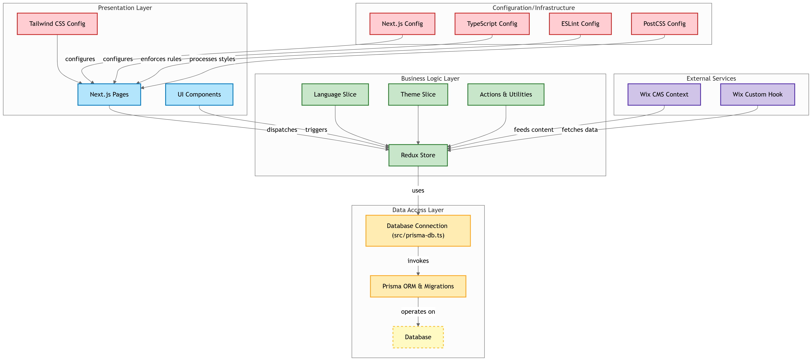

# 🌐 Landing Page

A responsive, modular landing page built with **Next.js**, **Redux**, **Tailwind CSS**, and integrated with **Wix CMS**.

## 🧱 Architecture

This project follows a clean separation between **Presentation Layer**, **Business Logic**, and **Configuration/External Services**:



### Key Components

- **Next.js Pages**
  - `Home`, `About`, `Projects`, `Contact`, `Dynamic ([slug])`
- **UI Components**
  - `Navbar`, `Menu`, `Slider`, `Filter`
- **State Management**
  - `Redux Store` with `Language Slice` and `Theme Slice`
- **Wix Integration**
  - `WixContext` and `useWixClient` for external content
- **Styling**
  - Tailwind CSS configuration for scalable design

---

## 🚀 Tech Stack

- **Framework**: [Next.js](https://nextjs.org/)
- **State Management**: [Redux Toolkit](https://redux-toolkit.js.org/)
- **CMS**: [Wix CMS](https://www.wix.com/)
- **Styling**: [Tailwind CSS](https://tailwindcss.com/)
- **TypeScript**: Type-safe development

---

## 📦 Installation

```bash
git clone https://github.com/YarC7/Landing-Page.git
cd Landing-Page
npm install

```
